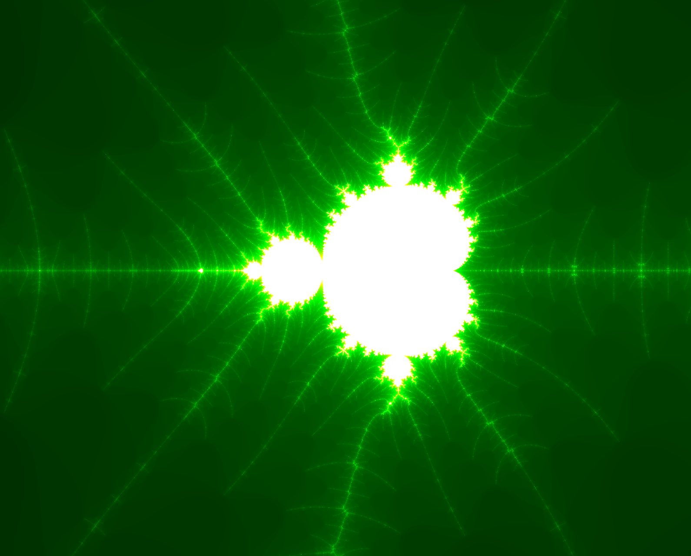
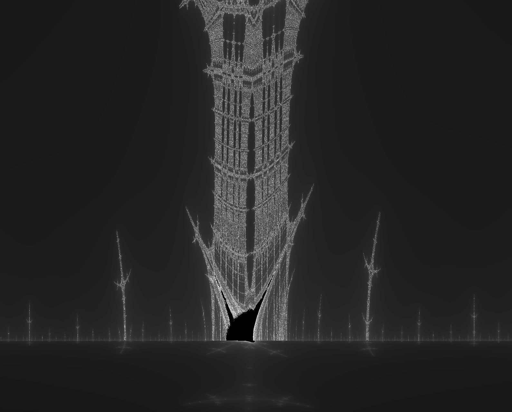

# fractal_explorer

Small C program to visualize and explore Mandelbrot, Julia and Burning Ship fractals.

## Libraries

* minilibX

## Usage

In your terminal:  
```sh
git clone https://github.com/4quet/fractal_explorer.git
cd fractal_explorer
make
```
  
Launch using:  
`./fractol <type> <color>`  
`<type>`: `"julia"`, `"mandelbrot"` or `"burning ship"`  
`<color>`: `"blue"`, `"red"`, `"green"` or `"black"`

### Key bindings

* **Left arrow**: Move left.
* **Right arrow**: Move right.
* **Up arrow**: Move up.
* **Down arrow**: Move down.
* **+**: Increase precision.
* **-**: Decrease precision.
* **M**: Toggle animated fractal. Only works on Julia.
* **Mouse scroll**: Zoom / Unzoom.
* **Mouse scroll click**: Reset fractal.
* **1 to 4**: Change fractal color (1: blue, 2: red, 2: green, 4: black).
* **ESCAPE**: Quit.

## Screenshots




